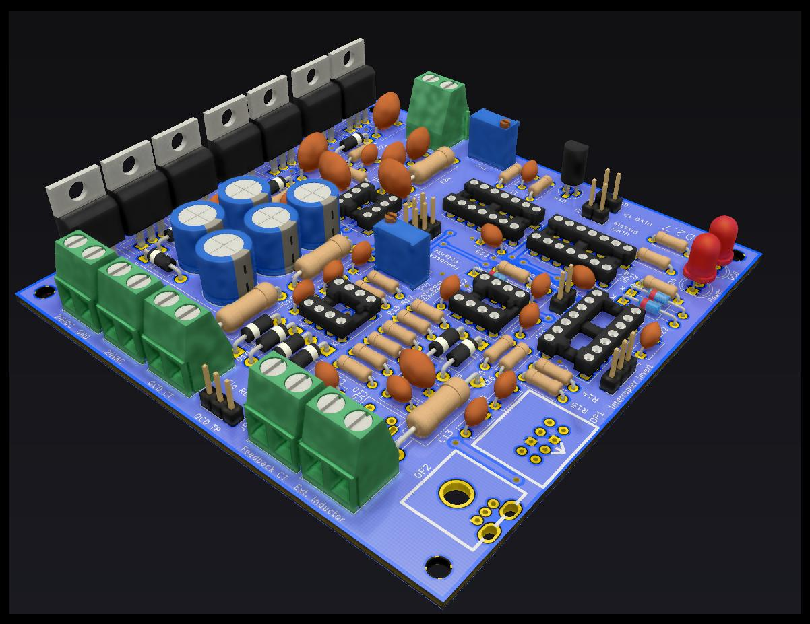
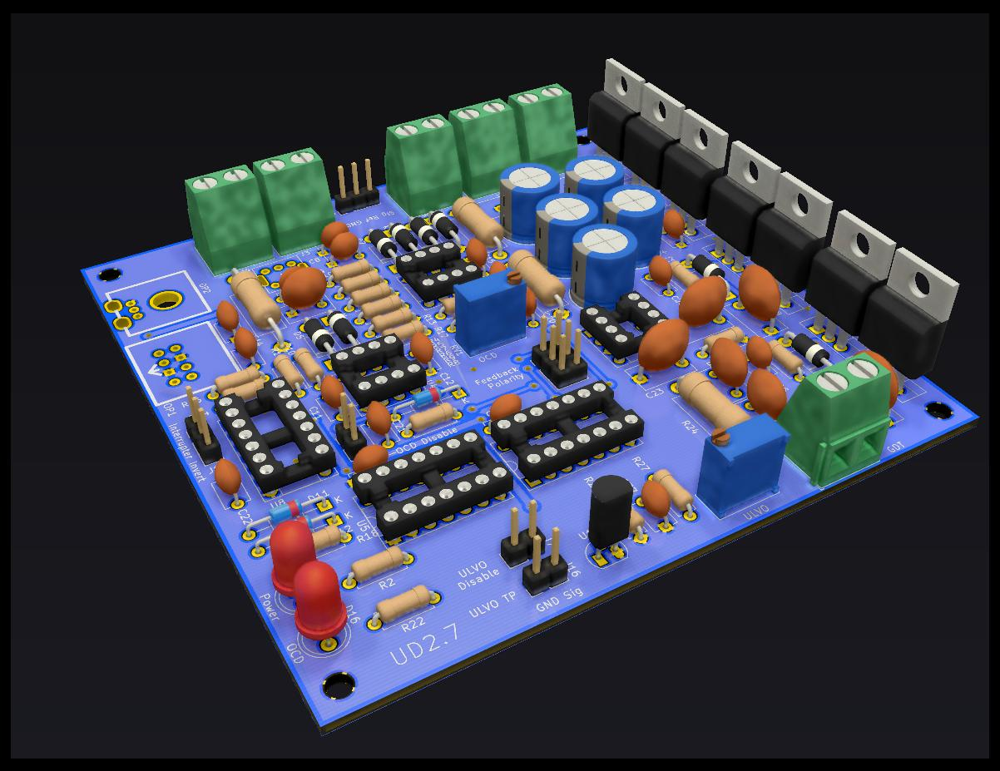
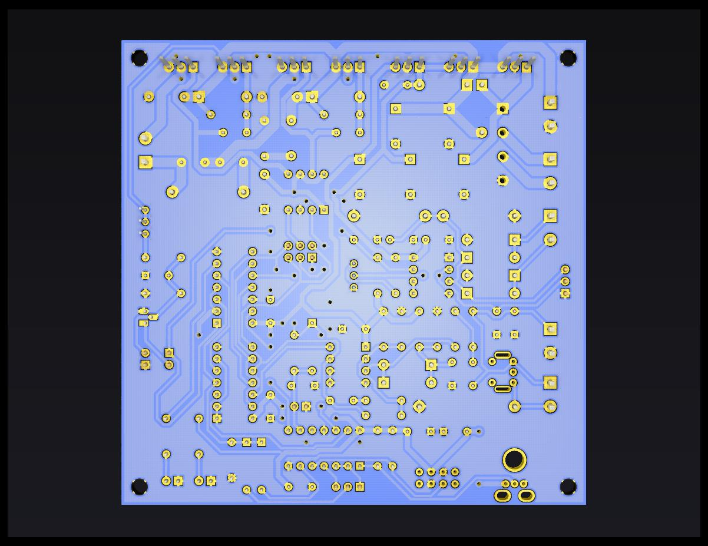

# UD2.7 Through Hole

## Description

This folder contains the KiCad files for the through hole edition of the UD2.7 DRSSTC driver. It uses the schematic and the footprints from the original UD2.7 THT profdc9 made. However, the layout is completely new.

Features:

* PCB can be manufactured as standard double sided PCB *and* as **single sided**. 
	* Top layer only contains straight connections that can be replaced by jumper wires. Note that this assumes you're using sockets for the ICs.
	* No layout modifications needed for single or double side manufacturing. 
	* Single side should be easier to manufacture at home. 
* All TO220 parts are on the same side of the PCB. One common (isolated!) heatsink can be used.
* Optical inputs and status LEDs are on the opposite side of the heatsink. All inputs are grouped on the left side, the GDT output is on the right.
* All testpoints are on the edge of the PCB. 
* All terminals, jumpers and tespoints are labeled. DC In and testpoints have the pinout marked as well.
* PCB size: 99mm x 99mm
* [Interactive BOM](https://github.com/MMMZZZZ/DRSSTC-PCB-Pack/blob/master/ud27c%20thru%20hole/bom/ud27c%20Interactive%20BOM.html?raw=true). A HTML document that allows you to visualize what part sits where. Great help during assembly! It allows highlighting nets, too, which is very useful for debugging.

## Preview

Here are some pics. Since the layout was made with single side manufacturing in mind, the routing doesn't look that clean but it should work. Power and ground are somewhat star like. 

